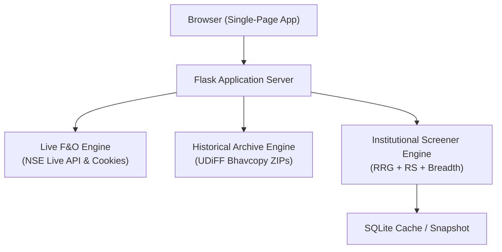

# 📊 NSE OI Spurts Dashboard & Institutional Market Move Screener

[](https://www.python.org/)
[](https://flask.palletsprojects.com/)
[](https://nse-oi-spurts-dashboard.vercel.app/)
[](LICENSE)

An institutional-grade, real-time analytics platform designed for active derivative (F&O) traders, institutional researchers, and swing traders in the Indian stock market. 

The application unifies **Real-Time F&O Open Interest (OI) Spurts Tracking**, **Historical NSE UDiFF Bhavcopy Archive Analytics**, and an **Institutional Sector Rotation & Relative Strength Screener** into a single, high-performance web dashboard.

---

## 🚀 Live Demo

- **Production URL:** [https://nse-oi-spurts-dashboard.vercel.app/](https://nse-oi-spurts-dashboard.vercel.app/)
- **Local Host:** `http://localhost:5000`

---

## 🌟 Key Features

### ⚡ 1. Real-Time Derivatives (F&O) OI Spurts Tracker
- **Live NSE Feed:** Tracks all active NSE Futures & Options contracts with sub-second price and open interest change updates.
- **Buildup Detection:** Instant classification of institutional order flow:
  - 🟢 **Long Buildup:** Price ▲ + OI ▲ (Bullish accumulation)
  - 🔴 **Short Buildup:** Price ▼ + OI ▲ (Bearish positioning)
  - 🔵 **Short Covering:** Price ▲ + OI ▼ (Bear squeeze)
  - 🟠 **Long Unwinding:** Price ▼ + OI ▼ (Profit booking)
- **Top 10 %OI Filter:** One-click toggle to isolate the most aggressive institutional moves across the market.
- **Auto-Refresh Engine:** Selectable intervals (Live 2s, 30s, 1 min, 5 min) with countdown indicator.
- **Trader Utilities:** Real-time search filter, CSV export, and 1-click clipboard table export.

---

### 📆 2. Historical Trading Calendar & UDiFF Bhavcopy Archive
- **Clean Interactive Trading Calendar:** Intuitive monthly grid view covering past trading sessions, official NSE market holidays, and monthly expiry dates.
- **Official NSE Archive Extraction:** Fetches genuine, uncompressed NSE UDiFF Bhavcopy ZIP archives directly from `nsearchives.nseindia.com`.
- **Zero Synthetic Data:** Computes exact day-over-day changes by downloading and parsing both the target date and previous trading session Bhavcopies.
- **Smart Date Fallback:** Allows querying any past trading session across historical months with automatic holiday detection.

---

### 🎯 3. Institutional Market Move Screener & Sector Rotation
- **JdK Relative Rotation Graph (RRG):** Analyzes macro industry rotation relative to the **NIFTY 500 benchmark (Center: 100)**:
  - 🟢 **Leading (Top-Right):** RS-Ratio > 100, RS-Momentum > 100 (Strong & Accelerating)
  - 🔵 **Improving (Top-Left):** RS-Ratio < 100, RS-Momentum > 100 (Lagging, but turning up)
  - 🟡 **Weakening (Bottom-Right):** RS-Ratio > 100, RS-Momentum < 100 (Strong, but losing momentum)
  - 🔴 **Lagging (Bottom-Left):** RS-Ratio < 100, RS-Momentum < 100 (Weak & Decelerating)
- **Macro Sector Breadth:** Evaluates internal sector health using % of constituent stocks trading above their **200 DMA** and **50 DMA**.
- **Composite Score (0–100):** Multi-factor institutional rating combining RRG position, multi-period Relative Strength (RS), 200-DMA trend filter, and sector breadth.
- **Universe Coverage:** Complete coverage across **20 Macro Sectors** and **All 500 Nifty & F&O Stocks**.
- **Instant Filters:** Quadrant pills (`Leading`, `Improving`, `Weakening`, `Lagging`), 200-DMA Trend Filter (`Bullish >200 DMA` / `Bearish <200 DMA`), and real-time search.

---

### 📈 4. Interactive Visual Canvas Charts
Built using high-performance, native HTML5 Canvas (60 FPS, Retina/Hi-DPI aware, zero bulky external charting libraries):
1. **🧭 Sector RRG Quadrants Chart:** Interactive 4-quadrant scatter chart with benchmark 100 crosshairs, hover inspection cards, and click-to-drilldown into constituents.
2. **📊 Sector Breadth (% >200 DMA) Ranked Bar Chart:** Horizontal ranked bar chart sorting all 20 sectors by breadth with a 50% benchmark guideline.
3. **🏆 Top Stocks RRG Scatter Chart:** Plots top institutional stocks with ticker symbols and relative momentum indicators.

---

### 🔗 5. Institutional Workflow Bridge (`⚡ OI` Action Button)
- Connects macro sector analysis with intraday execution:
- When a trader identifies a strong stock in the Screener (e.g., `BAJAJ-AUTO` in a Leading sector with a high composite score), clicking the **`⚡ OI`** action button automatically switches to the **F&O OI Spurts tab**, pre-filters that symbol, and displays its live derivatives positioning.

---

## 🛠️ Architecture & Tech Stack



- **Backend:** Python 3.11+, Flask 3.1
- **Networking:** Requests with persistent session cookies, automatic retry adapters, and NSE-compliant headers.
- **Frontend:** Responsive HTML5, Google Sans / Roboto typography, Pure HTML5 Canvas, Vanilla ES6+ JavaScript.
- **Compute Layer:**
  - Local: SQLite caching engine (`cache.db`) with background pre-warming thread for instant cold-start responses.
  - Serverless (Vercel): Embedded lightweight institutional snapshot (`screener_snapshot_data.py`) for zero-latency, zero-dependency serverless execution.

---

## 📁 Project Structure

```
nse-oi-spurts-dashboard/
├── api/
│   ├── index.py                    # Vercel serverless entry point
│   └── screener_snapshot_data.py   # Bundled Python snapshot for Vercel
├── screener_module/
│   ├── data/                       # Sector constituent mappings and DB tools
│   ├── indicators/                 # RRG, RS ranking, Breadth & DMA algorithms
│   ├── scoring/                    # Composite 0-100 institutional scoring logic
│   ├── screener_core.py            # Core computation layer
│   └── config.py                   # Sector configurations & constants
├── templates/
│   └── index.html                  # Unified modern dashboard frontend
├── server.py                       # Main Flask web server & background updater
├── screener_snapshot_data.py       # Root embedded snapshot for serverless fallback
├── vercel.json                     # Vercel deployment configuration
├── requirements.txt                # Python package dependencies
└── README.md                       # Documentation
```

---

## ⚙️ Installation & Local Setup

### 1. Clone the Repository
```bash
git clone https://github.com/niteshjind/nse-oi-spurts-dashboard.git
cd nse-oi-spurts-dashboard
```

### 2. Create and Activate Virtual Environment
```bash
# Windows
python -m venv venv
venv\Scripts\activate

# macOS / Linux
python3 -m venv venv
source venv/bin/activate
```

### 3. Install Dependencies
```bash
pip install -r requirements.txt
```

### 4. Run the Dashboard
```bash
python server.py
```

Open your browser and navigate to:
```
http://localhost:5000
```

---

## 📡 API Endpoints

| Method | Endpoint | Description |
| :--- | :--- | :--- |
| `GET` | `/` | Serves the unified web dashboard |
| `GET` | `/api/refresh` | Returns live/cached F&O OI Spurts data |
| `GET` | `/api/refresh?live=true` | Forces a real-time fetch from NSE India |
| `GET` | `/api/historical/<YYYY-MM-DD>` | Downloads and calculates F&O OI from official NSE Bhavcopy ZIP |
| `GET` | `/api/screener/data?timeframe=weekly` | Returns institutional screener data for all 20 sectors and 500 stocks |
| `GET` | `/api/screener/data?timeframe=weekly&refresh=true` | Forces re-computation of institutional indicators |

---

## 📝 Disclaimer

*This dashboard is designed for educational, research, and technical analysis purposes only. It is not financial advice. Derivatives trading (Futures & Options) involves substantial risk of loss. Always conduct your own research before making financial decisions.*

---

## 📄 License

This project is licensed under the [MIT License](LICENSE) &copy; 2026 **Nitesh Yadav**. All rights reserved.
